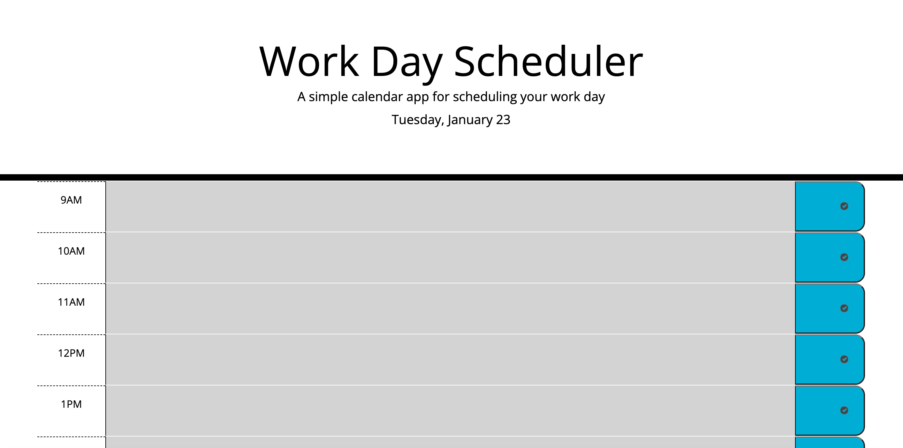

# Work-Scheduler

## Description

This work schedule page is a simple and efficient way to keep track of your daily tasks. The app automatically tracks time for you, displaying the current day of the week and color codes each time field - grey for the past time of the day, red for the present time, and green for future hours left in your standard working day from 9AM to 5PM. If you refresh the page, your schedule will still be saved. However, if you need to modify any tasks, you can simply overwrite them and click "save".

Link to the deployed project:
https://unicorn453.github.io/Work-Scheduler/

When opened the page should look like this:

## Installation

N/A

## Usage

To use the Work Scheduler app, simply add the task you want for any given time slot between 9 AM and 5 PM. Remember to save it with the button on the right so the task remains the same even if the page reloads. At the top of the page, you'll see the current day of the week, month, and date. Depending on your time zone, your schedule will turn different colours. The time slot that has passed will be grey, the present hour will be red, and the future hours will be green. To change and reassign the task, overwrite it and click save.

## Credits

The development of the code process involved leveraging ChatGPT.
Other resources:
I used a previously written README file as a template to create this README.
‌

## License

Please refer to the LICENSE in the repo.
